# 一、IQ调制

## 1、为什么要使用IQ调制

数字发射机利用数字调制调制信号，比较简单的有两种方式，ASK（Amplitude Shift Keying）和PSK（Phase Shift Keying），这两种方式分别用信号不同的幅度和相位表示数字bit（0和1），但它们都只能使用信号的一个特征（幅度或相位）来表示0和1，相当于我们用这样的方式调制的信号只能传递0和1两种不同的状态。那有没有什么方式可以传递更多不同的状态呢？比如像下图的方式可以让传递的状态增加到4个，但也只是对信号的相位变化的调控进行了细化。如果说我们将幅度的变化也同时加入进去，那就能表示更多的信息了
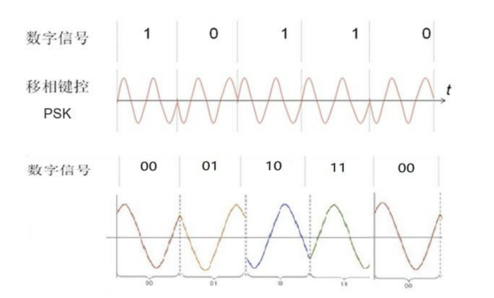
从上图中的时间坐标轴来看，对于四相位调制，其实用时间坐标轴下的波形来描述已经有些不清晰了。这里有一种更加直观的方式来表示不同波形的相位和幅度信息，那就是用极坐标表示，下图中$r$表示波形的幅度，$\theta$表示波形的相位。这样一来是不是清楚的多了。

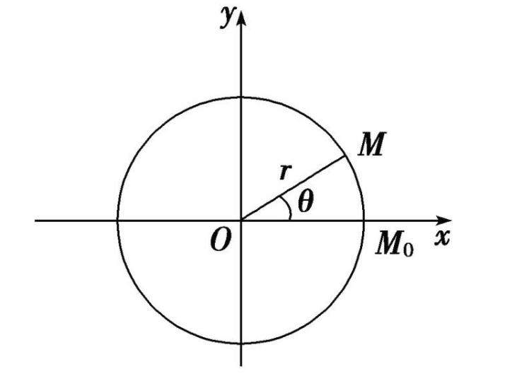

有了更加直观的分析方式，这下我们就可以发射**同时利用相位和幅度变化表示信息的信号**了。那这个信号怎么来，理论上，我们确实可以直接发射一个幅度和相位都变化的载波，但在工程中，直接实现对载波相位的精确调控是非常非常困难的，另外对于RX来说，分析出这样一个波的相位和幅度也是很难的。因此，工程上采用**IQ调制**的方式来输出我们想要的波形。

  

## 2、什么是IQ调制

IQ调制相当于**对两路正交载波信号进行调制，最后发射的是这两路信号合成后的信号**，如此一来，我们就可以只对两路信号的幅度进行调控来实现对发射信号的相位和幅度的调制（矢量的合成）。数学上表示为，

$$

x(t) = A_Icos(\omega_ct)-A_Qsin(\omega_ct).

$$

$A_I$和$A_Q$分别代表同相分量和正交分量的载波幅值。最终合成后得到的信号的幅度和相位分别为，

$$\begin{aligned}

A &= \sqrt{A_I^2 + A_Q^2},\\

\Phi &=arctan(\frac{A_Q}{A_I}).

\end{aligned}$$

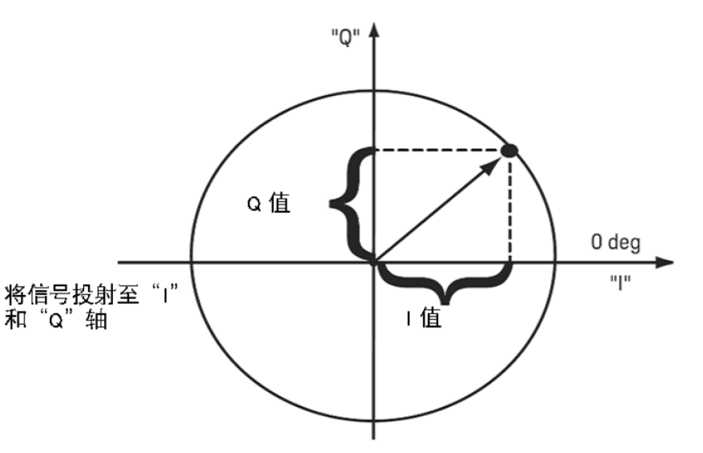

## 3、星座图

星座图可以更直观地显示IQ两路信号调制后的结果，示意图如下，每个点代表这个合成信号矢量的终点。
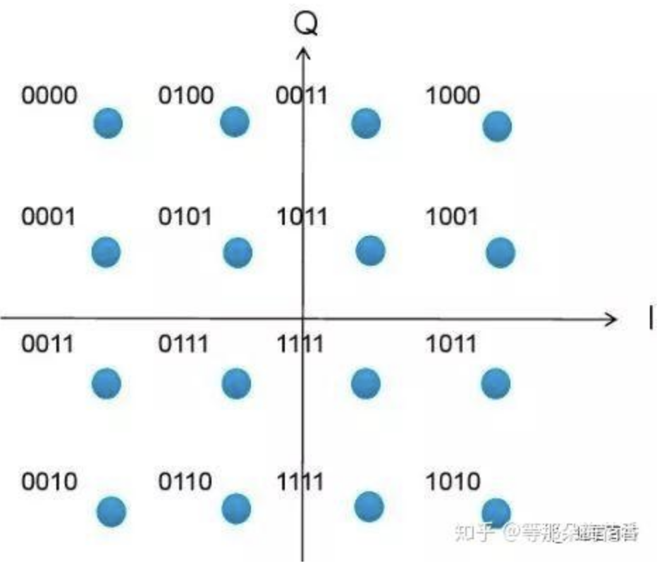

QAM相当于表示这个星座图中有几个点。为了发射信号的稳定性等等的考虑，调制IQ两路的数字信号的的bit数应该相同。所以理想的来说，如果每路有$n$bit，就能够得到$(2^n)^2$种不同的信号状态，相当于$4^n$QAM。可是考虑到现实因素，想让$n$bit的两路信号能够调制出$4^n$QAM是不可能的，因为PA的线性度并不是理想的（理论下$v_o = G \cdot v_i$），所以输出的信号的相位和幅度会和目标设定的有偏差，那么星座图上的点就一定也会跟理想点有偏差，这个偏差是无法预料的，也就是说理论上这些偏离的点就不可用了。因此，假如说我们需要4096QAM，应该在设定指标的时候留点余量，实际上应该将两路信号的bit数提到10bit。

  
## 4、误差矢量幅度（Error Vector Magnitude, EVM）

EVM是衡量数字发射机线性度的重要指标。在上文中提到了实际输出的信号在星座图上会偏离原来目标点的位置，我们就用EVM来量化这个偏离的程度。
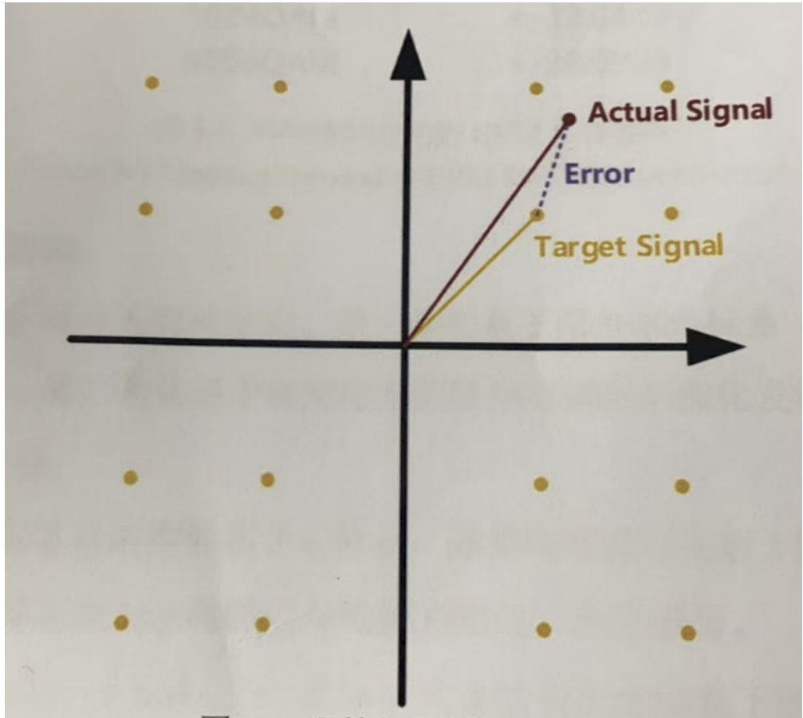  

EVM可以表示为，

$$\begin{aligned}

EVM &= \frac{A_{Err}}{A_{Tar}}，\\

EVM_{dB} &= 20lg{EVM}(d)

\end{aligned}$$

单位一般用dB，或用百分比。矢量差（Error）的幅值为$A_{Err}$，目标信号的幅值为$A_{Tar}$。一个系统的EVM等于对整个平面所有点信号的EVM计算得到的均方根的值，

$$

EVM_{rms} = \sqrt{\frac{\sum_{i=1}^{N}EVM_i^2}{N}}

$$

  

EVM越小，实际信号越接近目标信号。通常调制阶数越高，对EVM的要求就越严格。

## 5、数字预失真(DPD)

  

  

***

  

# 二、Filter

## 1、FIR Filter

### a. 为什么要做Filter

TX实际要传输的信号是0101这样的数字信号。假设我们的信号是一个串行$N$bit信号，在时域上可以用冲击序列来表示，

$$\begin{aligned}

x[n] &= s[n] \delta(nT_s),\\

x(t) &= \sum_{n = 0}^{N-1}s[n] \delta[t-nT_s].

\end{aligned}$$

其中$s[n]$才是我们需要传输的原始数字信号。$x[k]$只是用冲激序列将其在时域上表示的结果。

  

但其实理想的冲激信号在现实中是实现不了的，因此我们用方波来代替它，这个方法叫做零阶保持(Zero-Order Hold, ZOH)，在数学上的表达就是用一个$\tau = T_s$方波去卷积上我们原本的冲激序列，

$$

y(t) = \sum_{n = 0}^{N-1}x[n][u(t-nT_s)-u(t-(n+1)T_s)]

$$

FPGA就是通过ZOH的方式向TX输入信号的。原本最理想的情况下，时域中用冲激序列表示输入的信号，它的频谱应该也是冲激序列，但因为方波的卷积（时域卷积相当于频域相乘），相当于频谱变成了

$$

F(\omega) =E\tau sinc(\frac{\omega \tau}{2\pi}) \cdot F_0(\omega)

$$

原来的频谱现在产生了一个sinc包络，接近奈奎斯特频率处的信号会明显衰减，相当于这一部分要传输的信号严重失真，称之为杂散。为了抑制这些杂散的影响，我们需要使用滤波器。

示意图如下，
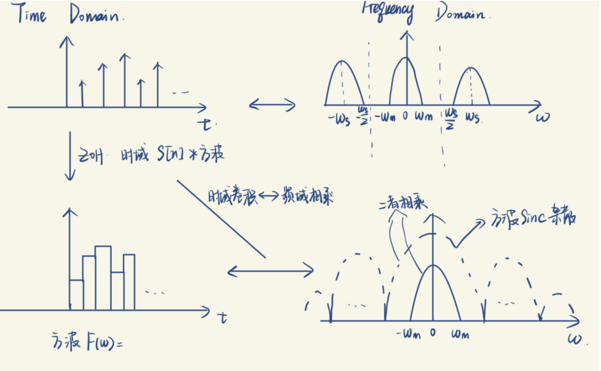
  

### b. 在matlab中的演示

  

## 2、Nyquist Filter

### a. 码间干扰

码间干扰（Iner-Symbol Interference, ISI）是指在传输过程中，一个symbol的信号残留或扩展到相邻符号的时间槽中，导致接收端难以准确区分和解码后续symbol。比如说实际上信号传输中的方波并不是理想的，而是会有一些扩展（斜坡），这会影响到后续信号。
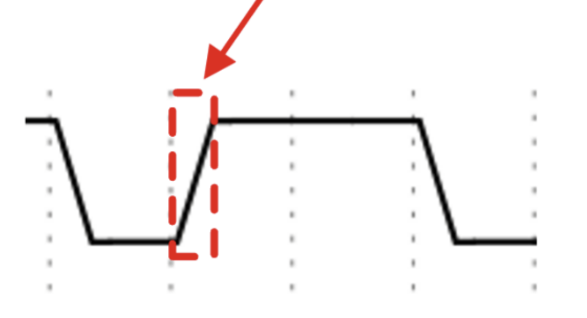
  

### b. Nyquist Filter怎么抑制码间干扰？

只要在下一个采样时刻到来之前使得前一个采样的影响为0，就可以抑制ISI。

在理想条件下，我们可以得到无ISI的条件应该为

* **Time Domain（其零点具有$sinc$函数特征）：**

冲激响应函数应满足：

$$

h(kT_s) =

\begin{cases}

1,\ k=0\\

0,\ otherwise.

\end{cases}

$$

* **Frequency Domain（奈奎斯特第一准则）：**

$$

\sum_{n=-\infty}^{\infty}H(f+\frac{n}{T_s}) = T_s, \ |f| \leq \frac{1}{2T_s}

$$

  

### c. 满足条件的滤波器

#### I. 理想低通滤波器

$$

H(f) =

\begin{cases}

T_s, \ |\omega| \leq \frac{f_s}{2}\\

0, \ otherwise.

\end{cases}

$$

在频域上就是一个方波，它在时域上的表示为：

$$

h(t) = sinc(f_st)

$$

但很显然，这样一个在时域中无限延续的$sinc$函数在物理上是不可能实现的，因此我们需要去寻找一种尽量接近的可实现的Filter来代替它。

  

#### II. 升余弦滤波器

理想低通滤波器有拖尾效应的原因是因为系统的频率截止过于“陡峭”，对这个截止处进行圆滑处理就可以减小拖尾效应（i.e.能让这个滤波器在物理上得以实现）。我们将这个圆滑的程度用滚降因子$\alpha$表示，它越大，则这个边沿越平缓。

  

***

## 3、Polyphase

### a. Interpolation和Decimation

#### I. Interpolation

插值最简单的实现方式是在原采样点中间插零，使得信号的采样率变成原来的L倍。Interpolation可以在频谱中实现这样的效果：

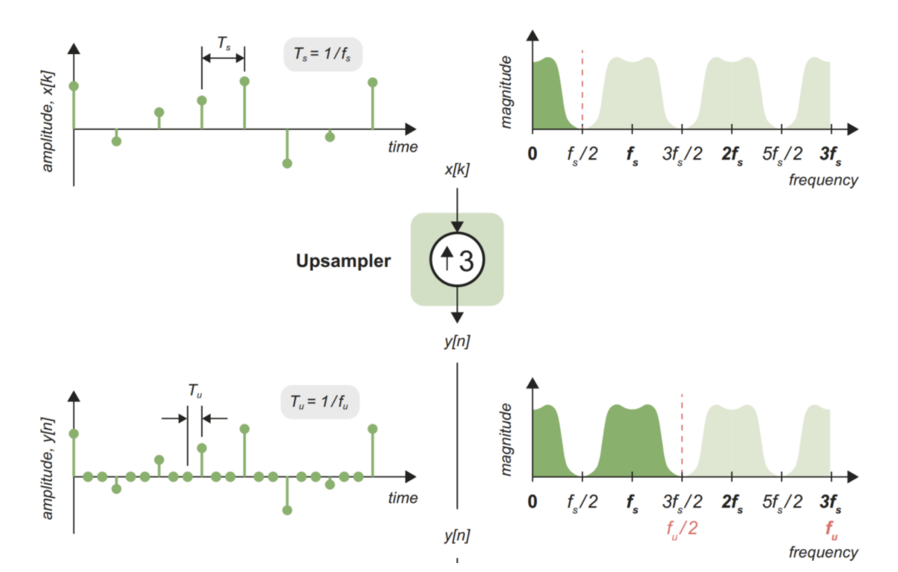

这样先进行插值后进行滤波就可以大大减小对滤波器的要求。

### b. Decimation

先滤波后抽值，以减小奈奎斯特区
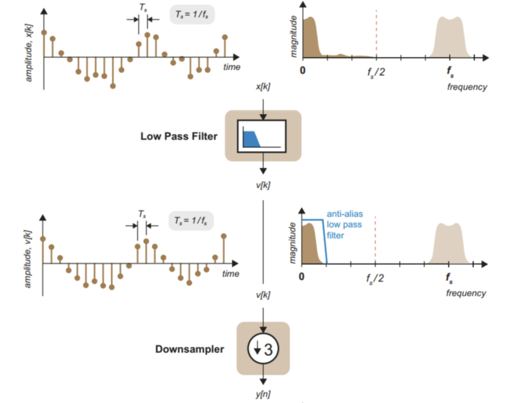
  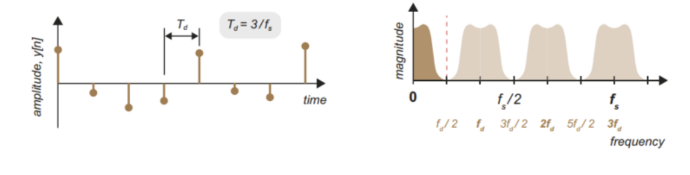

  

### b. Polyphase实现

#### 1. Interpolation

***

参数假设：

**Tap Coefficients**:$\ N$

**Original Samples**:$\ K$

**input**: $\ x[n] \overset{z}\leftrightarrow X[z]$

**interpolation factor**:$\ L$

**FIR impulse response**:$\ h[n]/H(z)$

**target output**:$\ y[z]/Y(z)$

**input after interpolation**:$\ x_{(L)}[n]/X_{{L}}(z)$

  

***

**Step 1. interpolation.** 在对原始输入信号进行插值后可以得到新的输入为，

$$

x_{(L)}[n] =

\begin{cases}

x[\frac{n}{L}], &n=0, L, 2L, ..., (K-1)L\\

0, &otherwise.

\end{cases}

$$

根据z变换时间扩展性质可以得到，

$$

X_{(L)}(z) = X(z^L).

$$

**Step 2. Filter.** 进行FIR滤波，

$$

y[n] = h[n]*x_{(L)}[n]

$$

时域卷积相当于频域相乘，再将Step1中结果代入可得，

$$

Y(z) = H(z)X_{(k)}(z) = H(z)X(z^L).

$$

  

已知Tap Coefficient为N（i.e.只有在0~N-1范围内$h[n]$才不为0，因此省略掉这个范围外的$h[n]$）

$$

H(z) = \sum_{n=-\infty}^{\infty} h[n]z^{-n} =\sum_{n = 0}^{N-1} h[n]z^{-n}

$$

  

可以得到（为了便于辨认，将$x[n]$替换为$x[k]$），

$$\begin{aligned}

Y(z) &= \sum_{k = 0}^{K-1}x[k]z^{-kL} \cdot \sum_{n=0}^{KL-1} h[n]z^{-n}\\

  

&=\{\sum_{k=0}^{K-1}x[k]\} \cdot z^{-kL}\{ \sum_{n=0}^{N-1} h[n]z^{-n}\}\\

  

&= \sum_{k=0}^{K-1}x[k] \cdot \{z^{-kL}\sum_{m=0}^{\frac{N}{L}-1}\sum_{r=0}^{L-1}h[mL+r]z^{-n}\}

\end{aligned}$$

  

  

转换到时域可以得到，

$$

y[mL+r] = \sum_{k=0}^{K-1} x[k] \cdot h[(m-k)L+r] \tag{1}.

$$

其中，$y[0]、y[8]、y[16]$这样几个点之间的间隔才符合插值前的滤波输出间隔。只有在$(m-k)>0$且$(m-k)L+r<N-1$时$\{x[k]h[(m-k)L+r]\}$才有意义，否则为0。

  

(1)式其实是插值加滤波后的最终结果，因此已经加入了相移。但我想知道为什么要将滤波器分为$L$组，因此我需要排除相移因素仅仅看值的叠加。假如说抽头系数为160，来举个例子看看，

$$

\begin{aligned}

y[0] &= x[0]h[0],\\

y[1] &= x[0]h[1],\\

...\\

y[7] &= x[0]h[7],\\

y[8] &= x[0]h[8]+x[1]h[0],\\

...\\

y[16] &= x[0]h[16]+x[1]h[8]+x[2]h[0].

\end{aligned}

$$

仔细观察以上顺序（$h[n]$是关于$x_{(L)}[n]$的FIR冲激响应），$y[0]$~$y[7]$每个相位都相差一个插值后的间隔。$y[0]$、$y[8]$、$y[16]$可以看成插值前$x[0]$、$x[1]$、$x[2]$和FIR冲激响应卷积后的结果。另外同理，$y[8]$~$y[15]$每个点相位相差一个插值后的间隔。

  

那就可以得出结论，我们需要将FIR滤波器的冲激响应分成$L$组，以方便对应相移要求。另外每组前后两个冲激响应应该差L个样本点。（具体看图吧，实在太乱了）

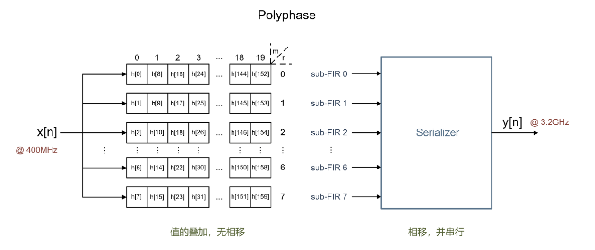

r为定值的每一行对应一种间隔的相移（相移实际在Serializer种完成），为了防止歧义（我之前理解错误过），给出一组sub-FIR的真正示意图像（并非我们真正使用的，只是示意），

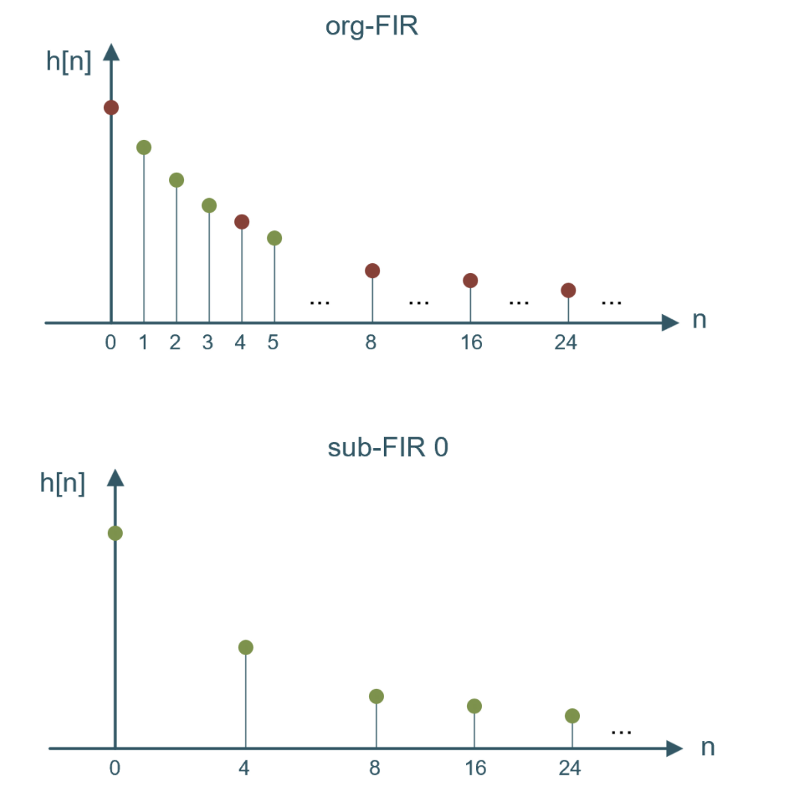

***

  

#### 2. Decimation（用不上，暂时不推了）

  

  

***

>附：
>1. $x[n]$的$z$变换定义为
>$$

X(z) = \sum_{n=-\infty}^{\infty} x[n]z^{-n}

>$$
>2. **z变换时移性质**
>$$

x[n-n_0] \overset{z}{\longleftrightarrow} z^{-n_0}X(z)

>$$
>在z域中乘以$z^{-n}$，相当于这个采样点在时域中延迟（右移）了n个采样点（采样周期）。
>
>3. **z变换时间扩展性质**
>若，
>$$

x_{(k)}[n] =

\begin{cases}

x[\frac{n}{k}], &n = 0,k,2k,... \\

0, &otherwise.

\end{cases}

>$$
>则，
>$$

x[n] \overset{z}{\leftrightarrow} X(z),\\

x_{(k)}[n] \overset{z}{\leftrightarrow} X(z^k)

>$$

***

  

# 三、编码方式

## 1、二进制码和温度计码

* **二进制码（Binary Code）:**

二进制的编码方式和计算机语言是一致的，比如说4bit的码字，表示范围就是0~15。那怎么区分高低位呢？打个比方，现在一共有4bit的二进制码，那么MSB就可以给一个放大倍数为“8”的DPA，LSB给一个放大倍数为“1”的DPA，以此类推，通过对这四个DPA的开关，就可以实现二进制码的表示。

回想一下MOS管源漏间电流的计算公式：

$$

i_{ds} = \frac{1}{2} \mu_n C_{ox} \frac{W}{L}(V_{gs}-V_{th})^2

$$

除了$W$，其余值都是固定的，那么因为$i \propto P$，所以我们可以通过调控$W$来控制DPA的放大倍数，就像图中左侧所示。但这会导致每一个PA的尺寸不同，导致失配。

* **温度计码（Thermometer Code）：**

温度计码的bit位就没有高低之分了，比如00011111就是代表5，00000011就是代表2，有N个DPA打开就说明其代表的数就是N。因此为了表示$2^N-1$个数，就需要$2^N-1$个cell。因为每个PA的权重相同，所以它们的尺寸也相同，因此它的失配会大大小于Binary Code。但是cell数量的增多也大大增加了设计难度。

## 2、混合使用二进制码和温度计码

从上述分析可以看出来两种编码方式各有利弊，这时候肯定就会出现这样的想法，我能不能结合一下二者的优点呢？在设计中，每一个DRFC都与一个码字位对应，该码字位可能是Thermometer Code也可能是Binary Code（一般会把**高位交给温度计码**，**低位给二进制码**，且温度计占的bit数会多一点），比如说一个信号共有6bit，低位2bit交给二进制码，高位4bit交给温度计码，这样可以尽量避免mismatch，同时也尽量减少cell数量。示意图如下，

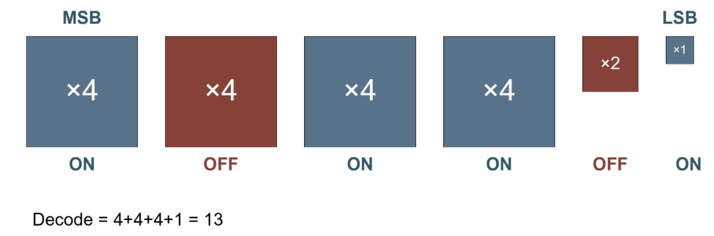
因此之后的DPA设计思路也是这样来的。