#### ——此笔记仅包含一些必须要知道的基础知识。

# 一、卷积（Convolution）

## 1、线性时不变系统（Linear Time-Invariant, LTI）

线性时不变系统有两个重要的特点：

1、线性（叠加性和均匀性）

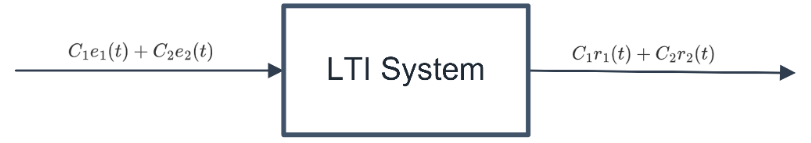

2、时不变性

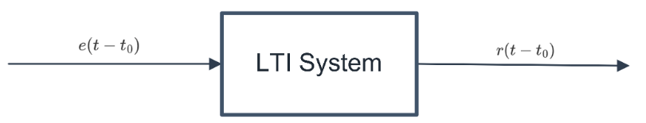

为什么要在这里提及LTI系统呢？因为$LTI$系统在**卷积**中有一个很重要的性质，这个性质也将会是我们分析设计Filter的基础。那接下来来看看这个重要的性质是什么。

## 2、LTI的卷积特性

#### ——与冲激响应有关：
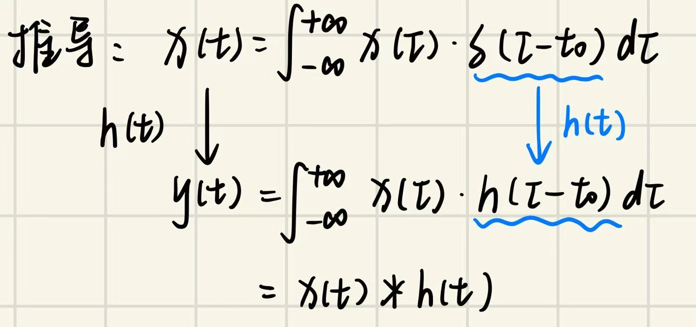

在$LTI$系统条件下，可以认为**系统的输出$y(t)$等于输入$x(t)$与系统冲激响应$h(t)$的卷积**，即

$$

y(t)=x(t)*h(t)=\int_{-\infty}^{\infty}x(\tau)h(t-\tau)d\tau=\int_{-\infty}^{\infty}h(\tau)x(t-\tau)d\tau

$$

上面的公式是对于连续时间系统的，但是在实际处理中我们的信号并**不是连续**的，而是**离散**的。因此需要给出离散时间的$LTI$系统输出$y[n]$的计算公式，

$$

y[n]=x[n]*h[n]=\sum_{k=-\infty}^{\infty}x[k]h[n-k]=\sum_{k=-\infty}^{\infty}h[k]x[n-k].

$$

此处要清楚$n$对应的是第$n$个$Sample$。

如果输入的是N个样本，则可以将公式写为，

$$

y[n]=\sum_{k=0}^{N-1}h[k]x[n-k].

$$

在刚接触到这个知识点时我觉得很迷惑，虽然公式以及其推导过程已经给出，但是我依旧很难理解它的实际意义，直到我看到了下面的两张图，

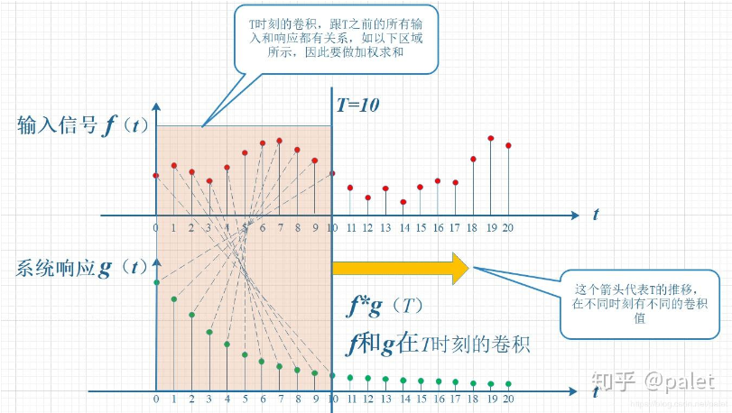
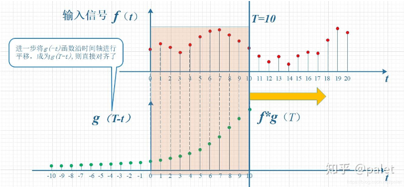

可以说，卷积其实是考虑当我们在第N个样本点输入的时间去观察系统输出时，之前所有输入对输出的影响之和。每个输入的影响都是不一样的，原因是：

1. 输入信号的幅度本身就不一样，相当于每个信号对输入的冲激信号的加权不同。

2. 某个具体时刻的影响会随着时间的流逝逐渐变化（变化的趋势和$h(t)$一致）。

## 3、卷积定理

我们已经知道了在时域中LTI系统的输入等于它的输入和冲激响应卷积的结果，那么这个卷积在频域中带来了什么影响呢？让我们来了解一下卷积定理。

### a. 时域卷积定理

若，

$$\begin{aligned}

f_1(t) &\leftrightarrow F_1(\omega), \\

f_2(t) &\leftrightarrow F_2(\omega).

\end{aligned}$$

则，

$$

f_1(t)*f_2(t) \leftrightarrow F_1(\omega)F_2(\omega).

$$
→**时域的卷积等于频域的乘积**
### b. 频域卷积定理

$$

f_1(t) \cdot f_2(t) \leftrightarrow \frac{1}{2\pi}F_1(\omega)*F_2(\omega).

$$

***

# 二、奈奎斯特采样定理（Nyquist Sampling Theorem）

#### ——此处不仅包括奈奎斯特抽样定理，同时也包含采样对信号带来的影响。

## 1、冲激采样（理想采样）

### a. 为什么要要考虑采样和它带来的影响？

这里需要清楚在**软件处理**中并**不存在**真正的**连续信号**，我们所得到的连续信号其实是**很多个离散点聚集在一起**的结果。那么从另一个角度来看，其实就是计算机或软件对信号进行了“采样”。这个采样不仅在时域上分离出了离散信号，它在频域上也带来了影响，而信号处理实际上是在频域中进行的。为了更加合适的信号处理，我们需要清楚它在频域上带来的具体影响。

### b. 采样的影响（Frequency Domain）

首先，让我们来走一遍采样的流程（理想的）。**采样是用冲激序列$\delta_T(t)$去进行采样**，

$$\begin{aligned}

\delta_T(t)&=\sum_{n=-\infty}^{\infty}\delta(t-nT_s),\\

f_s(t)&=f(t)\delta_T(t).

\end{aligned}$$
也可以写成，

$$

f_s(t)=\sum_{n=-\infty}^{\infty}f(nT_s).

$$
其中，$T_s$是采样时间间隔，$f(t)$是原始信号。

这个时候我们在时域中成功采样了，但不要忘记了真正的信号处理是在频域中实现的，所以来考虑下采样在频域中的影响。回忆下频域卷积定理，

$$

f_1(t)f_2(t) \leftrightarrow \frac{1}{2\pi}F_1(\omega)*F_2(\omega).

$$

再回忆下冲击序列的傅里叶变换，

$$

\delta_T(t) \leftrightarrow \omega_s \sum_{n=-\infty}^{\infty} \delta(\omega - n\omega_s),\\

(\omega_s = \frac{2\pi}{T_s}).

$$

所以最后我们可以得到在时域中采样后，频域中的结果为，

$$

\mathscr{F}[f_s(t)] = F_s(\omega) = \frac{1}{2\pi} F(\omega) * \frac{2\pi}{T_s} \sum_{n=-\infty}^{\infty} \delta(\omega - n\omega_s) = \frac{\omega_s}{2\pi} \sum_{n=-\infty}^{\infty} F(\omega-n\omega_s),\\

i.e.\, \, \, \, \, F_s(\omega) = \frac{\omega_s}{2\pi} \sum_{n=-\infty}^{\infty} F(\omega-n\omega_s).

$$
 →→→   **时域的采样等效于频域的周期延拓** 
 
最后我们发现，输入信号的频谱函数周期延拓了，这个延拓会带来什么新的问题吗？当然了，让我们画个图来看看是什么问题。（<u>这里的图先用书中的图代替，等整理好这篇笔记后再去细化</u>）
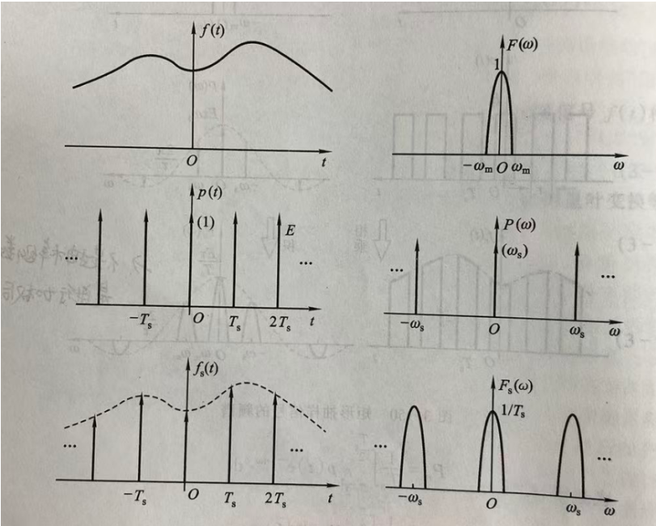
在每一个采样点（采样频率的整数倍）上都有一个频谱，看成频谱不断复制
  
这个图里看起来除了信号频谱周期延拓外好像没有什么别的影响了，但假如$\omega_s < 2\omega_m$呢？就会产生下图的问题——**混叠aliasing**
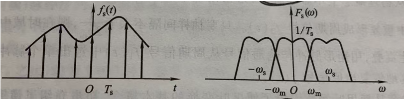
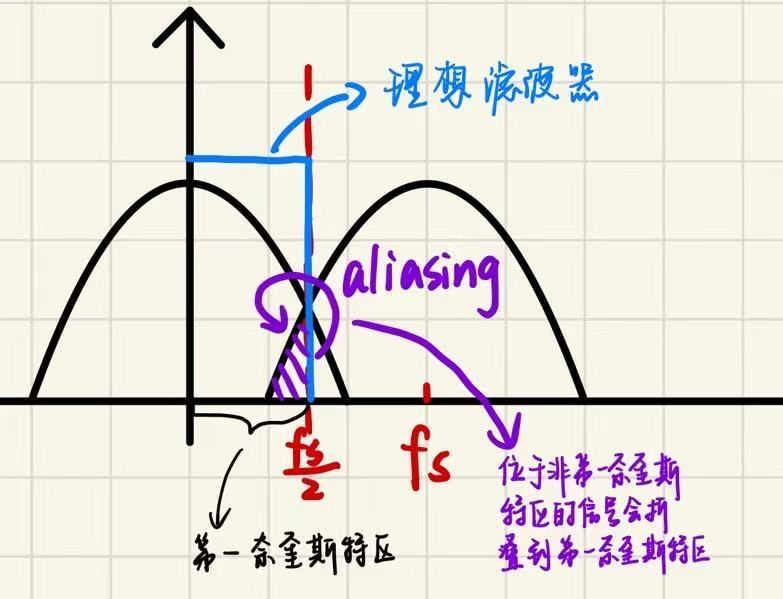
  
周期延拓后的频谱叠在一起了，这个现象叫做**频谱混叠（$aliasing$）**。显而易见，混叠部分的信号受到了影响，这不是我们所期望的（<u>这句话打个问号？是不是有些时候还要利用混叠？</u>）。为了避免aliasing，我们的采样需要遵守**奈奎斯特采样定理**。
## 2、奈奎斯特采样定理（Nyquist Sampling Theorem）

奈奎斯特采样定理公式如下，

$$\begin{aligned}

\omega_s &\geq 2\omega_m,\\

f_N &= \frac{f_s}{2}.

\end{aligned}$$

$f_N$是奈奎斯特频率（$Nyquist\, Frequency$）,它是采样频率$f_s$的$\frac{1}{2}$。采样率遵守这个定理，就可以避免频谱混叠。
***

# 三、傅里叶变换 FT

#### ——此处着重介绍Discrete Fourier Transform(D.F.T)

## 1、为什么要进行傅里叶变换？

首先先要明确一个概念：在工程上，只要信号满足适当条件，它就可以用正弦和余弦波的叠加来表示。进行**对信号时域到频域的转换**的过程我们称之为傅里叶变换(Fourier Transform)。我认为下面这张图很好的诠释了这一点
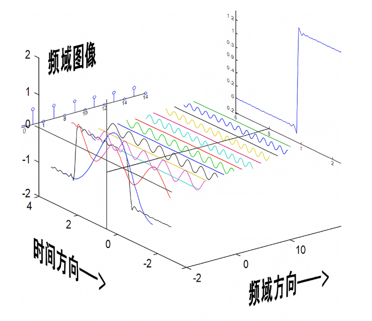
那我们为什么要进行傅里叶变换呢？拿声音来举个例子，现在我们需要对一首歌中的人声进行提取。从时域来看，这首歌的信号是非常杂乱的，每一个时刻都有不同的因素发出声音，对于这样的信号，我们是很难去分解它的。众所周知，不同的乐器发出的频率是不同的，那如果我们可以将这首歌中的信号映射到频域（理想情况下，每一种不同的声音对应着一个频率）后呢？显然可以留下我们想要的人声频率，那就可以将人声成功地分离出来了。在TX中也同理，对于一段信号，除去我们想要的信号外，这段信号中也混杂着很多“噪声”。为了滤去这些噪声，我们也需要将信号转到频域的角度去观察，提取出我们真正所需频率的信号。可以总结如下图
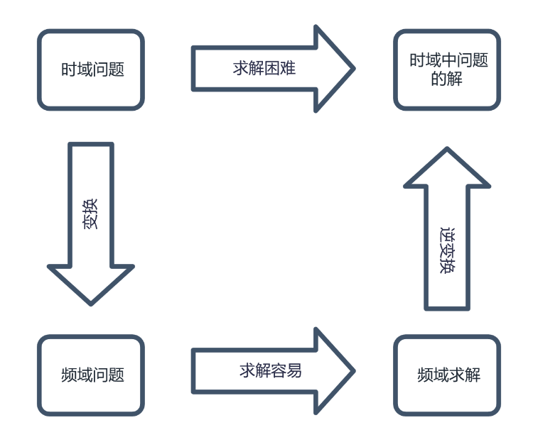

## 2、为什么要进行Discrte Fourier Transform(离散傅里叶变换D.F.T)？

这是因为在现实的软件计算中，我们是不可能得到一个完全连续的信号的，那些软件做出来的图其实是很多离散的点连成的。从另一个角度来说，实际中的**离散信号**其实是对理想中的**连续信号**进行了 **“采样(Sampling)”**。即通过采样将连续信号离散化，得到离散信号(一共采$N$个samples)，

$$\begin{aligned}

x(t)&=\sum_{n=0}^{N-1}x(t)\delta(t-nT_s),\\

x[n]&=x(nT_s).

\end{aligned}$$
显而易见，我们不能再对这个离散的信号进行$Continuous\, Time\, Fourier\, Transform(CTFT)$，而是应该进行离散傅里叶变换。先展示一下DFT的公式，

$$

X[k]=\sum_{n=0}^{N-1}x[n] \cdot e^{-j\frac{2\pi}{N}kn},\,k=0,1,2,3,...,N-1

$$

$x[n]$是输入信号的第$n$个样本点，$X[k]$是频域信号的第$k$个频率分量，$N$是信号长度（采样点数量）。

**DFT的变换结果是一个和时域信号序列等长的序列**。

DFT后的频率也是离散的，**它只在$f=f_k$位置上出现**，

$$

f_k=k \cdot \frac{f_s}{N}, \, \, \, k = 0,1,2,...,N-1

$$
***

>**Q1**:为什么频域点的数量和样本数量相同？

**A1**：这里可以用矩阵的思想来看问题，$x$可以看成一个$N \times 1$的矩阵（有$N$个样本点），$e^{-j\frac{2\pi}{N}kn}$可以看成一个$N \times N$的矩阵$W$，

>$$
X = Wx
$$

>$X$自然也是一个$N \times 1$的矩阵，即DFT后频率点的数量和时域中样本的数量一样。

***

另外，其实现代软件中的DFT实际上是$Fast\, Fourier\, Transform(FFT)$，它们将离散信号由时域转变到频域的方式，但FFT比DFT优秀在它能够把长度为n的DFT拆分成$nlog_2^n$层，每层需要$n$的工作量，因此FFT需要的总工作量只有$\Theta(nlog_2^n)$，这大大小于DFT所需的工作量。

***
>**Q2**：<u>为什么每层都需要$n$的工作量？</u>

>**A2**：
***

## 3、在matlab中仿真

### a. 单一正弦波

以一个周期为$T_0$的正弦信号$sin(\omega_0t)$为例（$\omega_0=\frac{2\pi}{T_0}$)，它的傅里叶变换结果应该为，

$$

\mathscr{F}[sin(\omega_0t)]=j\pi[\delta(\omega+\omega_0)-\delta(\omega-\omega_0)]

$$

我们对这个正弦信号进行采样，如果按照理想情况来考虑的话，这个正弦信号的频谱应该是$\omega = \pm \omega_0$处的信号以$\omega_s$的周期在频域中延拓的结果对不对？但其实在matlab仿真后的结果并非如此，我在matlab中对一个正弦信号（$f_0 = 64Hz$，$f_s=1024Hz$）仿真结果如下图所示，
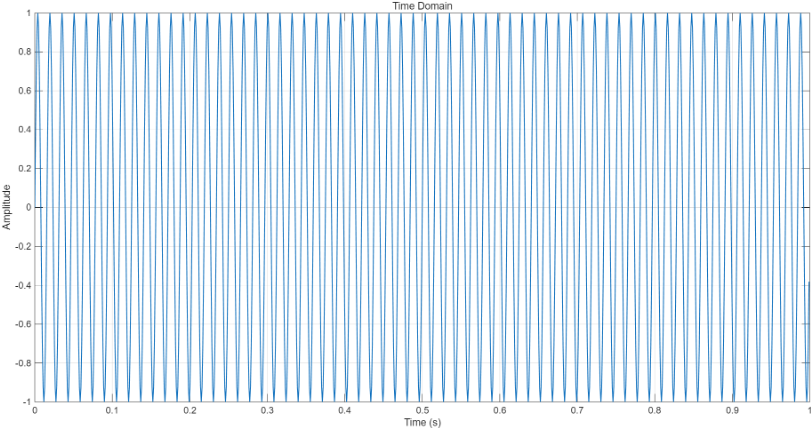
它的频谱为，
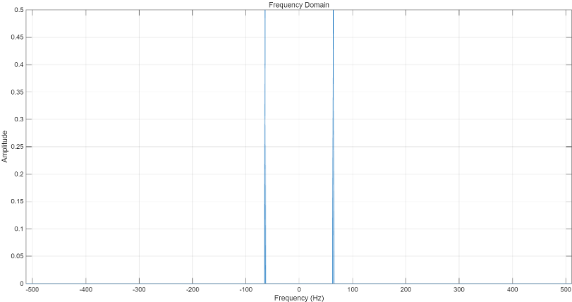
在这张图中，我们可以观察到：

1. 这个信号的FFT结果只在$\pm f_0$处出现。

2. 这张图的横坐标只现实了从-500~500Hz的频率。
   这两个现象其实是相-互挂钩的，正是因为横坐标显示的范围有限，所以FFT结果只在$\pm f_0$处出现，剩余的周期延拓的频率被这个范围截去了。
***

>**Q1**：为什么只显示$-\frac{f_s}{2}$~$\frac{f_s}{2}$（-500-500Hz）的范围？
>**A1**：因为没必要画出所有延拓的周期，它们只是无限重复的副本。FFT其实只采了一个采样周期内的频率。**注意**，如果按照这个方式来进行FFT的话，就要求采样符合奈奎斯特采样定理，不然就会发生aliasing，大大影响我们的结果。

***

### b. sinc函数


sa函数和sinc函数两者的关系：
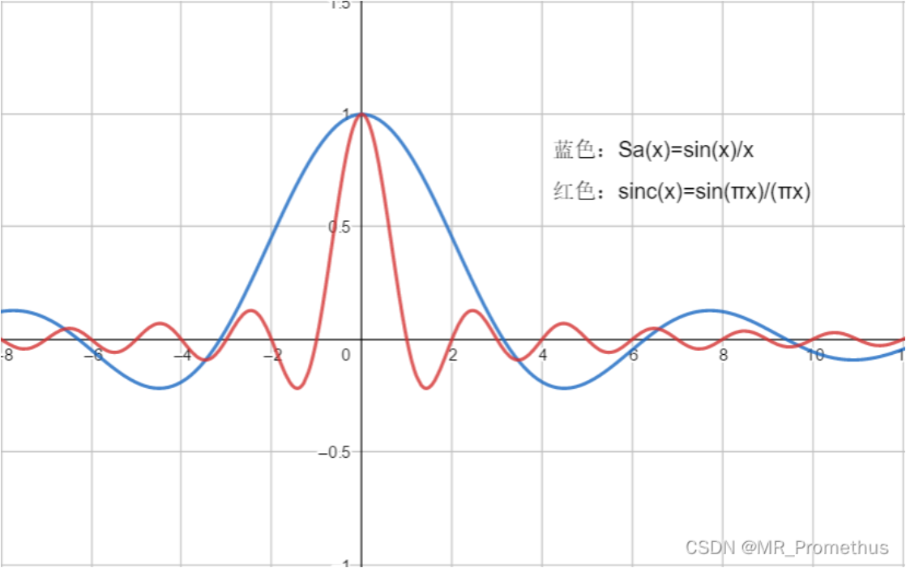


比如说我们现在在matlab中绘制一个sinc函数（**注意**：matlab中绘制的图形实际上是由很多离散的点构成的）

```

N_samples = 1000;

fp_6 = 0.2;

t_org = linspace(0,N_samples-1, N_samples);

seq_org = fp_6*sinc(fp_6*(t_org-N_samples/2));

```

通过对其进行傅里叶变换得到它的频谱为，
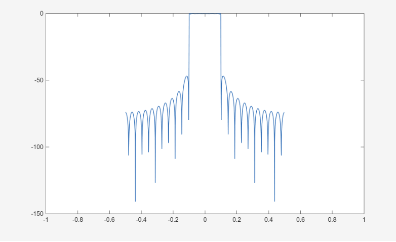

是不是跟想象中的有点不一样？理想中的频谱应该就是一个方波。这是因为：

1. 这个sinc函数并不是无限时间的（无限显然是不可能的），我们可以将时域的函数看成一个方波乘上了一个sinc函数，由此截取了时域中的一部分实现了红色图中的效果。

2. 时域上相乘等于频域上卷积（具体公式见之前），因此频谱中本为一个方波的波形卷上sinc函数后，就变成了蓝色图的样子。

## 4、方波的傅里叶变换
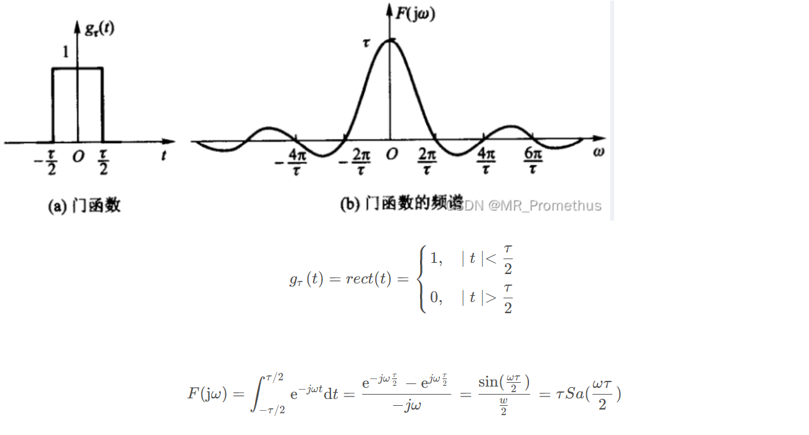


  


  

# 四、零阶保持（ZOH）

#### ——可以视作一种DAC

在我们的项目中，输入天线的是数字信号，相当于0101...这样的二进制数据，在时域中它们是这样的，

  

  

***

  

***

>**常用的傅里叶变换**

>1.

>$$

>Sa(\omega_c t) \leftrightarrow \frac{\pi}{\omega_c}[u(\omega + \omega_c) - u(\omega - \omega_c)]

>$$