# 一、SCPA原理
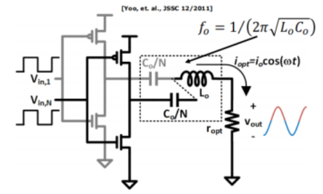
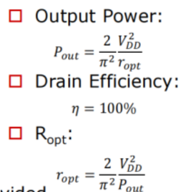
## 1.1 SCPA的本质

在每一个Class-D PA后面接上一个小电容，这个电容是作为开关（switch）电容，这整体叫做Switch Capacitor PA。再对Switch Capacitor PA进行**切片（Class-D的width进行切分，电容的大小进行切分）**，切片出的对应每一个温度计码中的子cell。

>接小电容有两个原因：第一个原因是，电容具有隔直流的作用，输入给阻抗匹配网络和天线的电流是交流的，不需要直流，直流的存在也会使不必要的功耗变大，所以可以用小电容隔去直流；第二个原因是，**起到方便阻抗变换的作用（某一个实阻通过串联电感，并联电容，最后再串联电容，就可以在smith圆上变换到更高的阻抗）**。

## 1.2 SCPA的特点
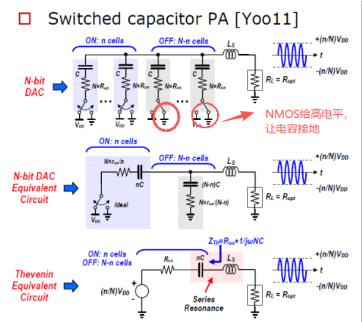

OFF的cell是有的cell通了直流，是不需要的电流，所以需要关掉，通过给NMOS高电平，使电容接地；ON的cell是工作的cell

下面两张图都是等效电路（并联电容相加）

>1. 不管SCPA打开或者关闭多少子cell（一直在VDD和GND两种状态中切换，等效一直接入交流地，小信号模型——电源和地都看成交流地），其等效电容为N个C并联，等效电阻为N个Ron并联；

→**无论n怎么变，等效电容和等效电阻都不变，所以线性度好，阻抗匹配稳定。**

>2. 电源电压等效为打开的子cell与总cell数量的比值，即(n/N)×VDD，因此电源完全由子cell开启决定，是**完全线性**的。（与Class-D不同，随着子cell开启增多，Ron会减小，因此子cell数量与等效电源电压不成线性关系）
  注：实际电路中回退效率下降的原因是开关关断时（输入恒为1，N管接地），OFF开关cell输出节点等效到GND的寄生电容（并联C） + ON开关cell的输出电容（串联C）组合形成的 “并C串C” 匹配网络，并不能把饱和输出下的Ropt完美转换至回退下的Ropt’，因此随着开关持续关断，SCPA的负载阻抗会逐渐偏离实轴（离理想阻抗点越来越远），导致DE逐渐下降。

## 1.3 SCPA的缺点

1. 开关切换不连续带来的delay会恶化EVM、ACLR和OOB noise即带外噪声。
   解决方法：需要提高开关切换速度。

2. SCPA阵列切换跳跃不连续带来的glitch也会恶化EVM、ACLR和OOB noise。
   解决方法：需要尽量避免相差过大码字的切换，通过优化实现更精细平滑的模式切换。

3. 阵列bit数决定了SCPA用作RF DAC的精度，需要尽可能提高bit精度。

# 二、SCPA尺寸参数计算

>Parameters:
>1. $P_{out} = 17dBm=50mV$
>2. $Cells = 127 (7bit)$（全部用Thermometer Code）
>3. MOS:

目前决定$P_{out}=17dBm$，使用差分结构，假设采用t40工艺，$V_{DD}$为1.1V

$$

P_{out} = \frac{2}{\pi^2} \frac{(2V_{DD})^2}{r_{opt, diff}}

$$

得到，

$$

r_{opt,diff} = 19.6 \Omega

$$

由于使用差分结构，需要将$r_{opt,diff}$平分

$$

r_{opt,singleside}=\frac{r_{opt,diff}}{2} = 9.8 \Omega

$$

假设$\beta = 90 \%$，由

$$

\beta = \frac{r_{opt}}{r_{opt}+r_{on}}

$$

得到，

$$

r_{on} = \frac{1}{9} r_{opt,singleside} = 1.09 \Omega

$$

假设$mul = 100$，则

$$

r_{on} = 1.09 \times 100 = 109 \Omega

$$

为了方便仿真，计算$I_D$

$$

I_D = \frac{V_{DD}}{r_{on}} = \frac{1.1}{109} = 10mA

$$

**下面需要根据算出来的Id不断调整mos管的尺寸：**

- step1：搭出如下的电路
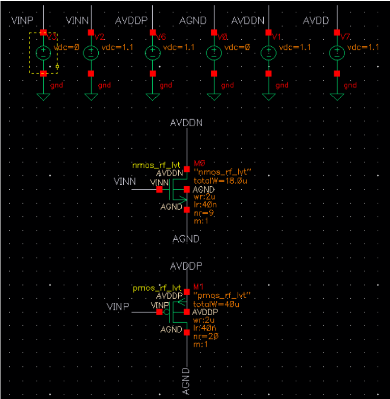
- step2：dc仿真
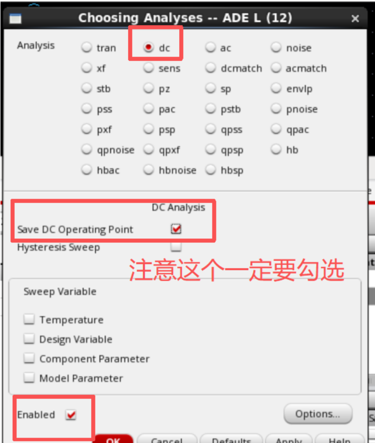

- step3：点击仿真台的Results-Annotate-Design Defaults查看Id电流（会直接显示在输出端）
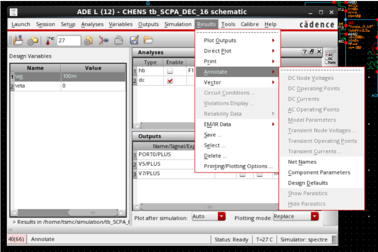

- step4：根据电流的大小不断调整finger width和finger number（Q一下mos管进行调整成）

>**目前决定采用**

>PMOS: $fingers = 10, \ finger\ width = 4\mu m,\ multipler = 100$
>NMOS: $fingers = 10, \ finger\ width = 1.8\mu m,\ multipler = 100$
>$$PMOS:W_{total} = 10 \times 4 \times 100 = 4000 \mu m$$
>$$NMOS:W_{total} = 10 \times 1.8 \times 100 = 1800 \mu m$$
  

# 三、SCPA电路结构图(差分结构）

**差分是为了抑制共模**

总体电路：
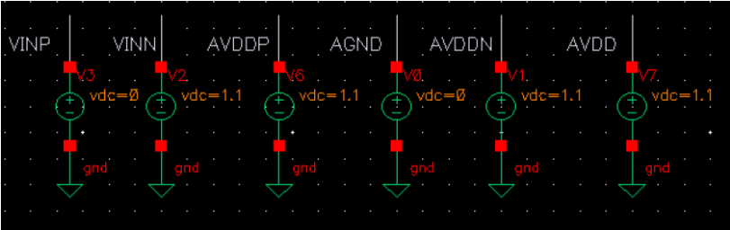
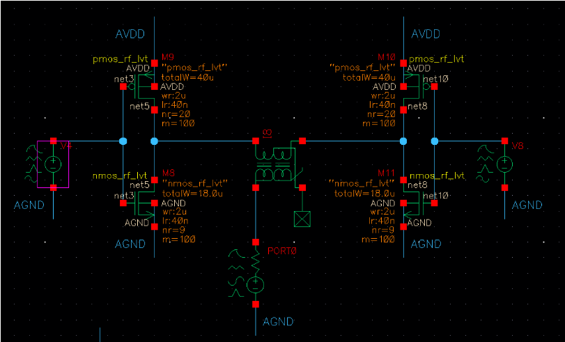

几个注意点：
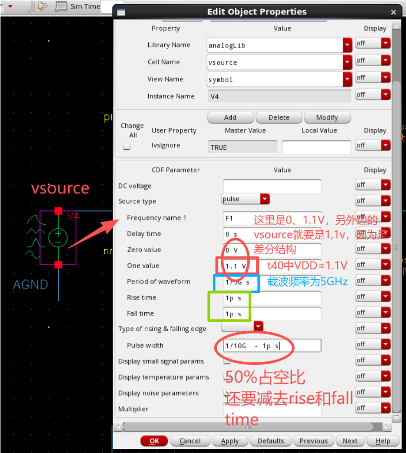
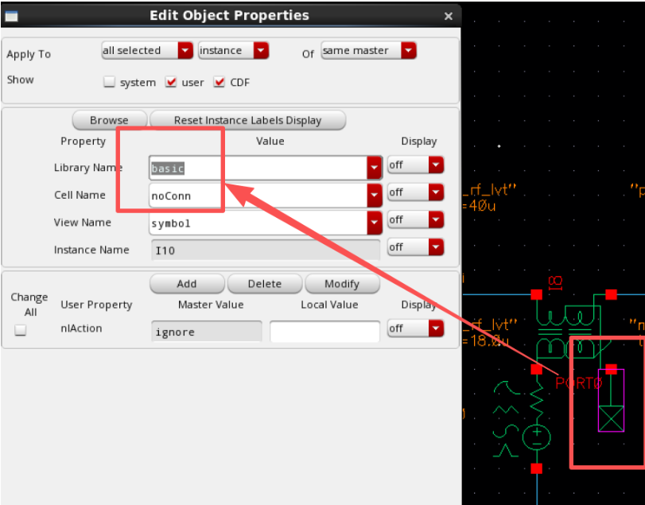

# 四、LoadPull找到最佳匹配阻抗
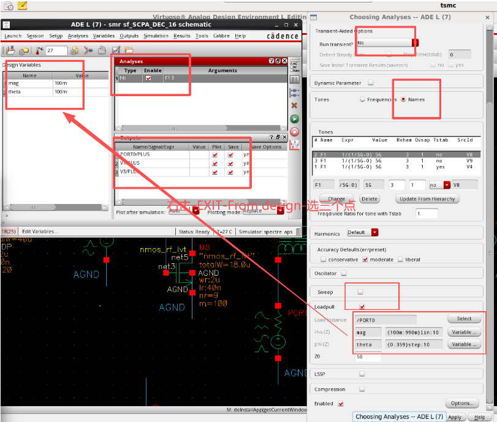
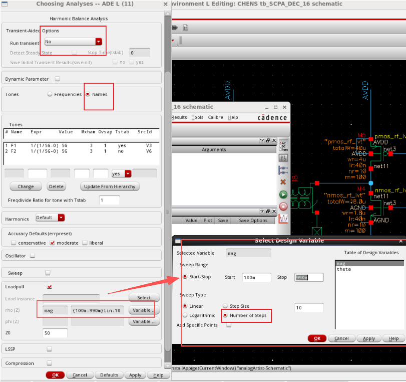
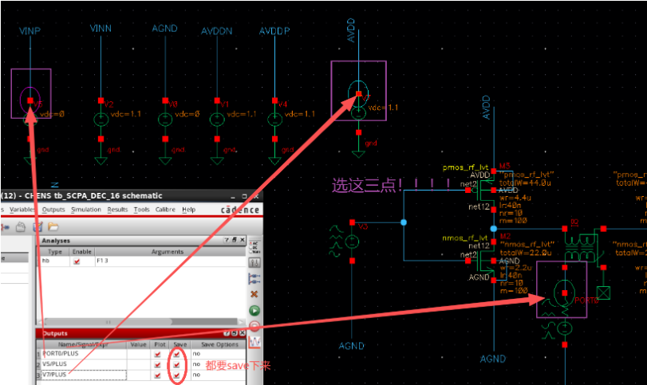

再在工具栏中找到点击main form
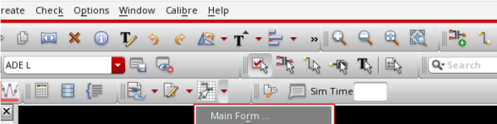

如下两个操作是为了显示PAE和Pout的值：
进行Power Added Eff仿真
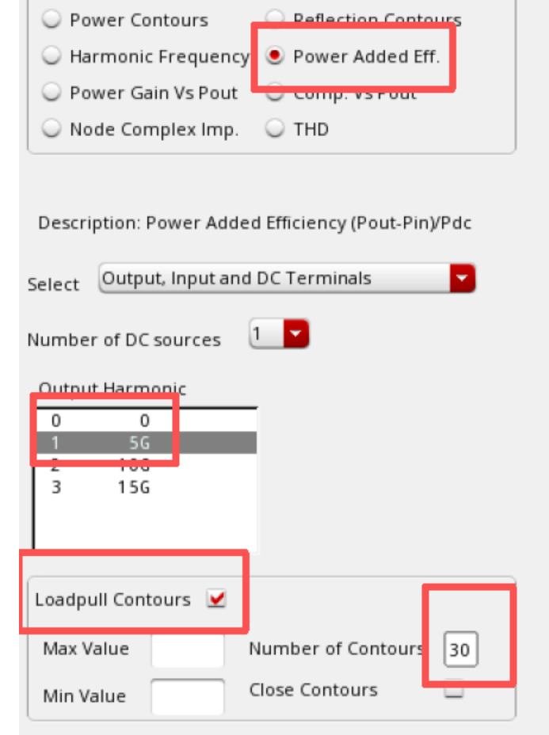
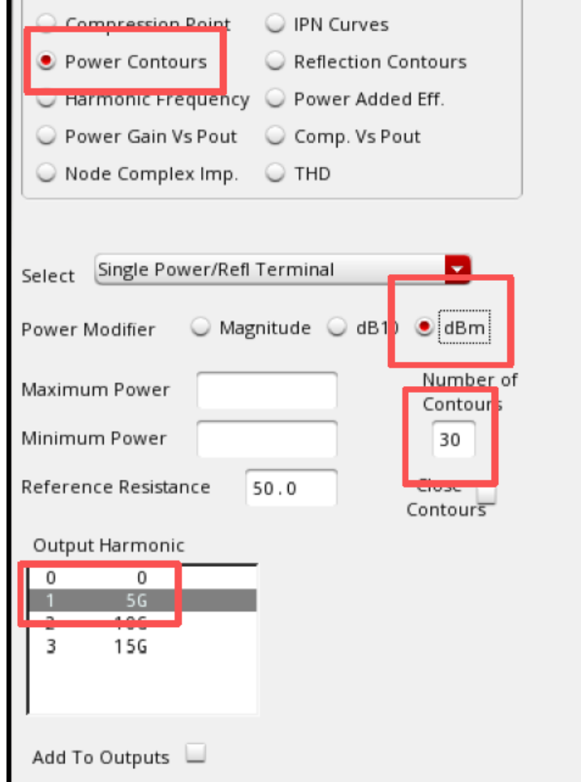

看下PAE最大那个点附近的Pout如何，如果在17dBm左右就可以选那一个点作为最佳匹配阻抗，若是不在17dBm左右，可以不断调整finger width和finger number再重复同样的操作

按照如下操作查看那一点的阻抗：
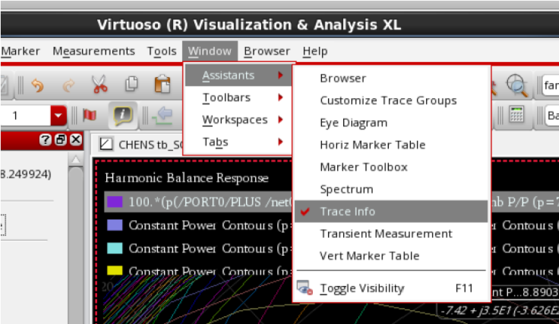
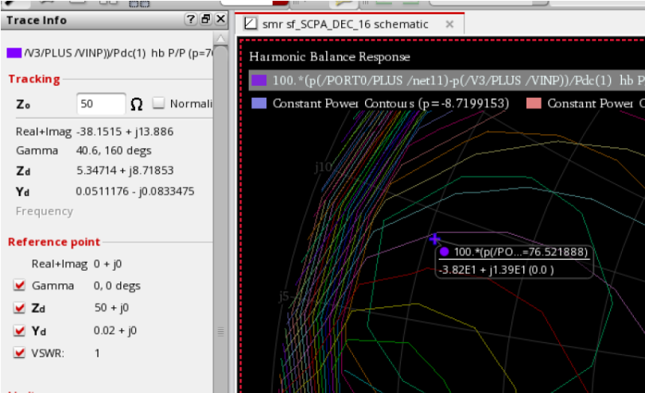

# 五、 阻抗匹配（in ADS）

由Virtuoso通过loadpull得到匹配阻抗应该为$5.35+j8.72 \Omega$，带着这个值去ADS中进行阻抗匹配：

设置ZS为loadpull找到的匹配阻抗，ZL为50，在原图上由ZS走到ZL，分别得到并联电容、串联电感、串联电容（低通），前面一个串联的电容是每个SCPA后面跟着的开关小电容：
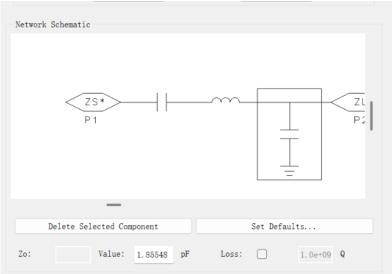
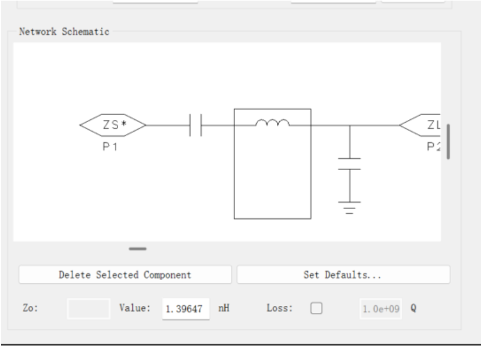
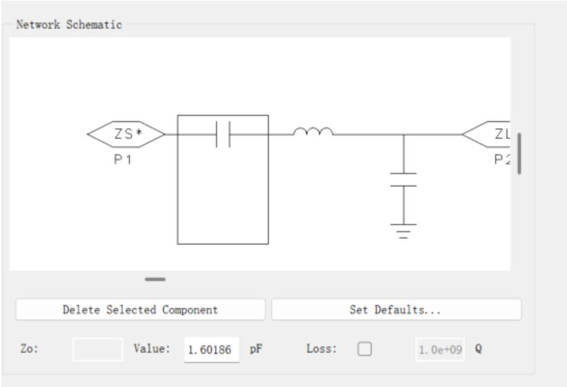

* 采用以下匹配方式，其中两个电容（由左至右）分别为$1.86pF,\ 1.60pF$，电感为$1.40nH$

这样的结果是经过Transformer转换后的单端处电容电感，现在要将串联电容转换到双端去。

> 单双端电容怎么转换：$C_{diff,oneside} = 2C_{SE}$ (SE:single end)

  

得到，

$$

C_{diff, oneside} = 2 \times 1.60 = 3.20 pF

$$

分给127个cells，得到

$$

C_{cell} = \frac{C_{diff, oneside}}{N_{cell}} = \frac{3.20}{127} = 25fF

$$

  

# 六、阻抗匹配验证（tran）
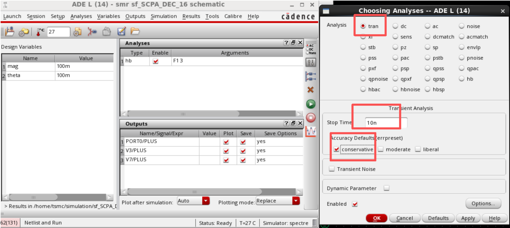
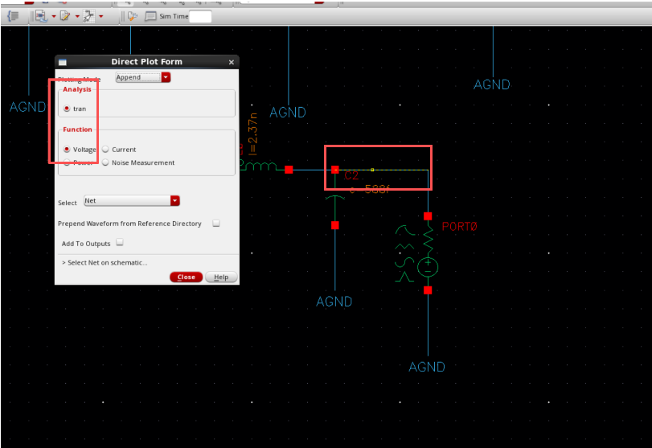

选择main form，再选中输出电压的那根线（**virtuoso里面线代表电压，点代表电流**）
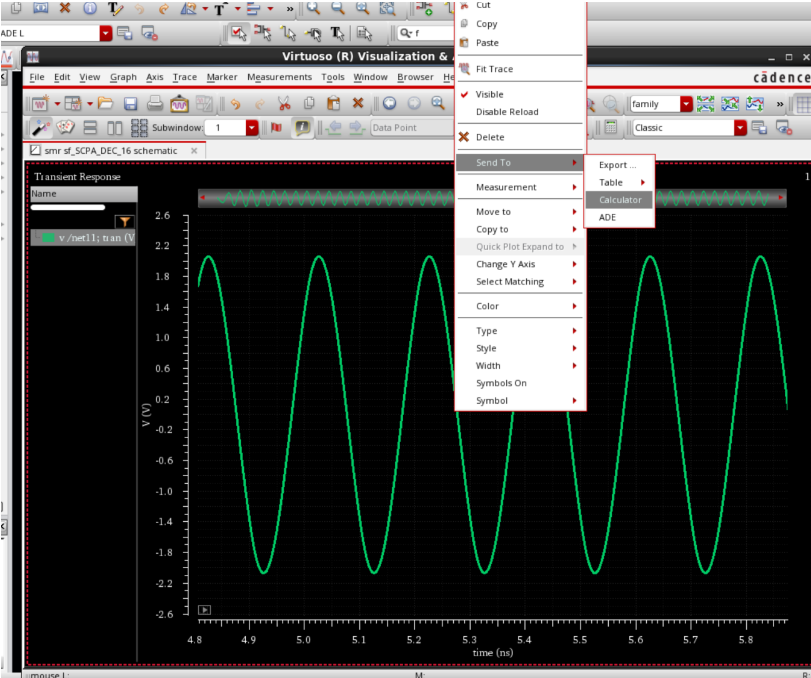

送到计算器

点一下黑色部分再点一下线，截取部分波形

得到以下在计算器的界面：

在公式搜索框搜索rms，计算**均方根**:

点击齿轮，将其送回仿真框：

回到仿真台，右键->Edit，对计算出来的值进行改名:

将其送回计算器继续计算Pout:

回到计算器，找到Expression Editor，有时候会藏在左下角，仔细找找:

计算Pout（Urms的平方/50，注意平方的表示方法）：

同样计算完回到仿真处改名（改名为Po）：

计算Idc，也就是AVDD的输入电流的平均值，同样送回仿真参数，改为Idc：

再根据Pdc=Idc×1.1（t40工艺里面VDD为1.1v）

最后计算Pout=（Po/Pdc）×100，重复以上步骤送到工作台并重新命名：

最后勾选上述几个数值的save，点击右边框出来的plot可以在value处看到数值：

# 七、virtuoso切片

>Parameters

>

  

# 八、码字输入

#### a. 生成一个Thermometer Decoder

将以下的代码输入到virtuoso的veriloga的cellview中，之后生成symbol

存入电脑的文件后，在tb里面导入vsource：

  

#### b. 用与门进行上混频

利用以下代码生成一个与门

  

#### c. 码字上混频打入SCPA

将码字和载波信号输入与门对基带信号进行上混频，再打入SCPA，得到结果是一个线性的三角形

>#### `这里要特别注意一点！！！！！`

>输入的基带信号应该给低频，比如说200MHz左右，而不是直接用嘉睿师兄的软件生成2GHz的信号，这样是会出问题的！一定要用载波频率的信号源对基带信号进行上混频！！！！！！！

>注意这个上混频时钟信号用于差分结构时应该是两个反相的时钟！！！！！！

  

# 九、封装

用symbol封装切分后的scpa 单元

添加pin：

形成symbol：

复用式instance引入，改名字即可，图中显示的是复用10个

>symbol的形状可以自己画

  

  

  

# 十、最后形成这样的电路：

