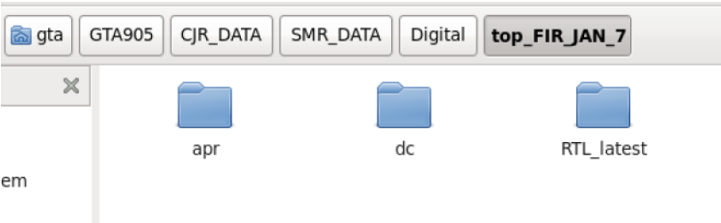
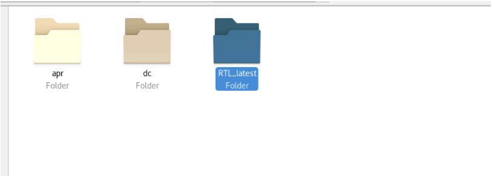
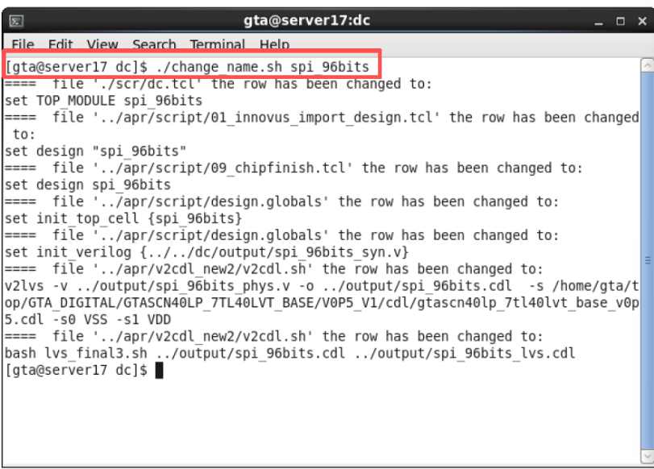

整个流程有⼀个模板的⽂件夹，以这个模板为基础，开始以下的流程：

# 1.导入Verilog文件

通过scp指令将Windows中的Verilog⼯程（RTL中的.v文件）导⼊到RTL_latest 这个⽂件夹中

# 2.建立Digital Circuit

## a.改名

将代码放入RTL_latest之后，退回到上⼀级⽬录，进⼊dc ⽂件夹，输⼊以下指令改名：

> ./change_name.sh current_top_module_name

注意：不是直接输⼊ current_top_module_name 这串⽂字，⽽是输⼊你的代码中top模块的名字。

  

## b.修改约束周期

在dc⽬录下进⼊到scr⽂件夹内，打开constraints.tcl，修改约束周期：

改的是时钟的周期，在always #5 sclk=~sclk；中，这里应该改成10；

  

## c. make find & make syn

退回到dc⽂件夹之后，在其中打开terminal，输⼊**make find** 指令确保RTL⽂件夹内所有的源码都被包含，可以进⼊data⽂件夹中去确认，确认完后，继续在terminal中输⼊**make syn**。

  

## d.确认结果合理

进⼊rpt⽂件夹，打开**current_top_module_name.timing**⽂件，下翻到底找到 **slack(MET)** 这一行，只要显示**大于等于0**就可以确认综出来。

  

# 3.布线 （Place&Route，PR）

## a.打开innovus

* 【apr】【work】，打开terminal，输入innovus（出现failed没关系，继续enter）

* 打开innovus后，继续在之前的terminal中输入：

> source ../script/01_innovus_import_design.tcl

(这里输入01后可以用tab补齐，不用挨个打）

注意：一定一定要在输入innovus的那个终端中使用source指令，一定一定，如果这个终端被关上了，就得重新开一个输入innovus后才能进行后续操作

  

## b.修改布局

经过上述步骤后，可以得到整体的布局，如果想改变布局，可以打开【Floor Plan】【specify】修改其中的Width&Height（可以不改，改的话面积最好差不多）

  

## c.设置pin

* Edit→pinEditor→布线

* 在之前打开innovus的terminal中继续按照02~09的命令顺序跑完剩下的部分

>source ../script/02_...(这里按tab之后会自动补全）

>

* 跑完之后，到v2cdl_new2中运行该命令：

  

# 4.导入virtuoso

## a.在gta里打开virtuoso

  

## b.导入到library中

* 创建一个library

  

* 从virtuoso窗口import

>**SPICE是原理图，Stream是版图。原理图导入.cdl文件，版图导入的是.gds文件**

  

**SPICE:**

**Stream：**

More Options修改：

#### `这里要特别注意一点：在virtuoso里面打开schematic或layout的时候用read only，不然稍微动一根线就完啦！！！`

  

# 5.在virtuoso中仿真验证

## a.建立数字综合电路的symbol

按照下图在schematic里面创建symbol

点击ok之后改上下左右的pin

  

## b.搭建tb

i，放入之前library创建的symbol，放好symbol之后，**点击symbol高亮后再按空格键自动出现每个pin的label**：

添加AVDD,AGND,SCK,MOSI,CS:

其中SCK设置成和之前.v文件里周期一致（50MHz）的pulse即可：

MOSI和CS都用matlab生成的dat文件导入，通过scp传到gta的Ditital_data中，再导入：

最终：

  

## c.ADE_XL

ADE_XL是在ADE_L的基础上创建的

设置好后直接点击仿真

  

## d.plot波形

选择一个字节，plot波形：

可以直接给出这一个字节的十进制表示：

显示如下：

  

## e.将对应的bus的digital结果导出

存为CSV文件：

